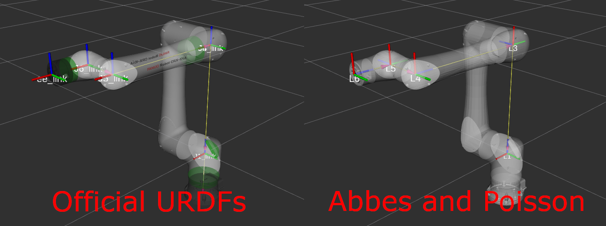
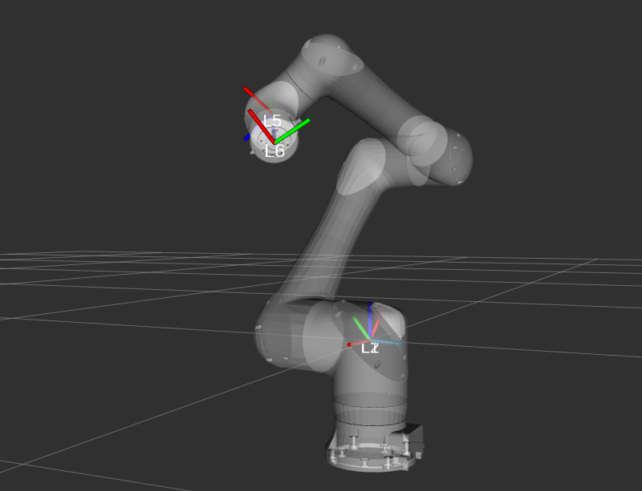
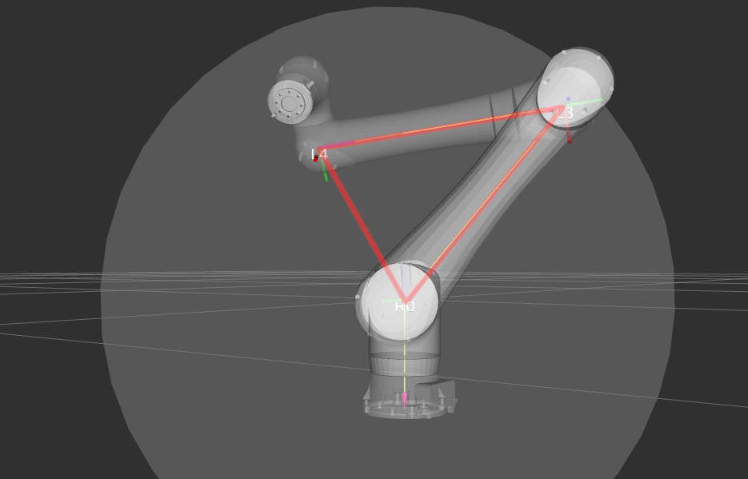
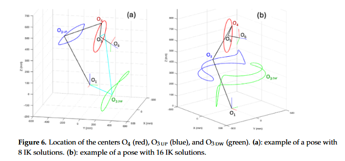
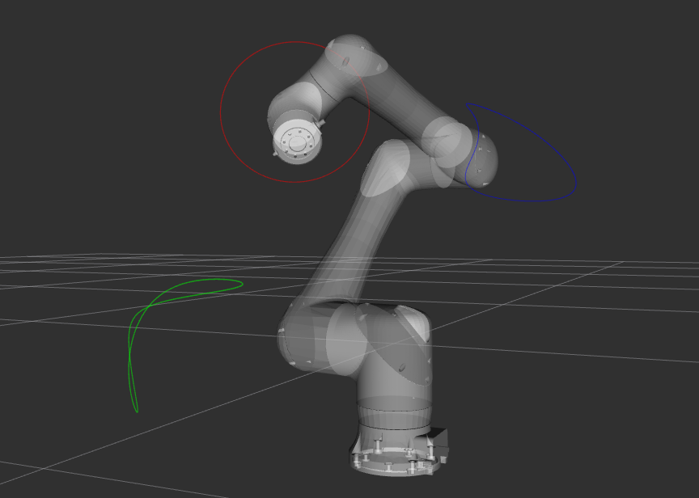

# Overview

The approach described in Abbes and Poisson (2024) does not yield an analytical (closed-form) solution. Instead it reduces the problem to a 1-D search for zeros over a scalar function.

## Summary of FK implementation

Some details about the FK implementation and coordinate frames differ from [the official Fanuc URDF descriptions](https://github.com/FANUC-CORPORATION/fanuc_description/), so are worth mentioning:

* Takes into account the "J2/J3 coupling", replicating the behavior on the Fanuc controller.
  - In short, J3=0 means a horizontal forearm, regardless of the angle of the upper arm.
  - The official Fanuc URDFs do not replicate this behavior (it would require adding a mimic joint between J2 and J3).
  - Care should be taken when interpreting the J3 angle (add J2 to obtain the non-coupled value).
* The tool frame orientation is defined to be consistent with the Fanuc controller: "Z forward, X up".
  - In contrast, the official URDFs use "X forward, Z up" (identical to the base frame orientation).
* The placement of the link frames differ from the official Fanuc URDF descriptions.
  - The Z-axes always correspond to the direction of positive rotation.
  - More importantly, the placements of L3, L4 and L5 are quite crucial to follow along with the derivation of the approach.



That said, this can still be used with the official URDFs, provided some small wrapping of the FK/IK functions to "undo" the J2/J3 coupling and account for the different definitions of the TCP frame.

## Summary of IK approach

### 1. CRX robots are not spherical-wrist
While the industrial Fanuc robots (and most industrial 6DOF robots from other makers) have spherical wrists, for which IK can be solved analytically (see e.g. [opw_kinematics](https://github.com/Jmeyer1292/opw_kinematics)), the CRX robots have an **offsetted wrist**. If L4 and L5 would have had identical origins, the wrist would become spherical. But as can be seen in the right image above, they have a distance (call it `O4O5`) along L5's axis of rotation.

### 2. Derivation of the geometric IK approach

The derivation is summarized below. The main goal is to find valid placements of _the origins_ of each frame in 3D space, starting from L6 and walking down the chain. Once found, joint angles can be obtained via basic trigonometry, starting with L1 and walking back up the chain again.

Given a desired 6DOF pose as the input to IK, placement of the origins of L6, L5, L2, and L1 is trivial. That leaves L4 and L3.



#### 2.1 Possible placements of O4 are restricted to a circle

Due to the axes of L5 and L4 being perpendicular and at a fixed distance `O4O5`, L4 is constrained to lie along a circle perpendicular to the end effector forward direction, with center at `O5`, and with a fixed radius `O4O5`. The paper introduces the "sample variable" $`q ∈ [0, 2\pi]`$, parameterizing all possible "candidate positions" as `O4(q)`.

#### 2.2 Given a O4 placement, O3 can be placed in two ways, constrained to a plane

Given a candidate placement `O4(q)`, `O3` is required to lie on the vertical plane containing `O4(q)` and the origin `O0`. In this plane, placing `O3` corresponds to [finding the apex of a triangle where all sides are known](https://math.stackexchange.com/a/544025) (`norm(O4)`, `norm(upper_arm)`, `norm(lower_arm)`).



In fact there are two ways to place `O3` for a given candidate placement `O4(q)`, corresponding to "elbow up" or "elbow down" configurations. The image above shows the "elbow up" configuration.

Plotting out all the potential positions of `O4` and `O3` (in both the "up" and "down" configurations) yields Figure 6 from the paper:






#### 2.3 Feasibility of O4 candidate positions

Beyond being restricted to a circle, there is a second restriction that determines if a given candidate placement `O4(q)` is mechanically feasible: The fact that the axes of rotation of L5 and L4 must be perpendicular.

Only specific placements of `O4` (choices of `q`) yield a configuration where `O3` (in the "up" or "down" configuration, or in special cases both) lands in the plane such that the axes of rotation of L5 and L4 become perpendicular.

In other words, if we choose some `q` and find that the resulting placements of `O4` and `O3` maintains this perpendicularity, we have found a valid joint solution for IK. 

This perpendicularity is maintained when the dot product between
* the directional vector `O3` $\to$ `O4`
* the directional vector  `O4` $\to$ `O5`

is zero.

#### 2.4 Reducing the problem to a 1-D search over a scalar function

Using these dot products, we can create the two scalar, continuous functions `f_up` and `f_down`:


```math
f_{up} : q \mapsto dot(norm(\overrightarrow{O_{3,up}O_4}),\hspace{0.5em} norm(\overrightarrow{O_4O_5}))
```
```math
f_{down} : q \mapsto dot(norm(\overrightarrow{O_{3,down}O_4}),\hspace{0.5em} norm(\overrightarrow{O_4O_5}))
```

In this way, the problem of finding valid joint solutions is reduced to finding all values $`q^* ∈ [0, 2\pi]`$ such that either $`f_{up}(q^*) = 0`$ or $`f_{down}(q^*) = 0`$. There exists [many efficient numerical approaches](https://en.wikipedia.org/wiki/Root-finding_algorithm) for this. The paper does not mention which method they used, but
* The Python implementation uses [scipy's implementation of Brent's method](https://docs.scipy.org/doc/scipy/reference/generated/scipy.optimize.brentq.html#scipy.optimize.brentq).
* The C++ implementation uses the more basic [Bisection method](https://en.wikipedia.org/wiki/Root-finding_algorithm#Bisection_method).

#### 2.5 Valid frame placements to joint solutions

Each root $`q^*`$ yields a valid joint solution, since `O4(q)` and `O3(q)` ("up" or "down", depending on whether this $`q^*`$ was a root of `f_up` or `f_down`) constitute kinematically feasible placements of the last two frames `L4` and `L3`, for which basic trigonometry then yields the joint angles.


There are some small details left out (e.g. triangle inequality check, dual solutions), but the above should give a decent summary of the core ideas of the approach.
