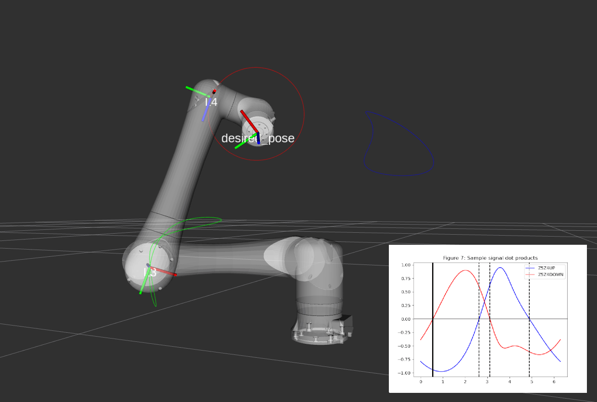

# crx_kinematics

<div align="center">

[](https://github.com/danielcranston/crx_kinematics/actions/workflows/humble.yml)
[](https://github.com/danielcranston/crx_kinematics/actions/workflows/jazzy.yml)
[](https://github.com/danielcranston/crx_kinematics/actions/workflows/kilted.yml)
[](https://github.com/danielcranston/crx_kinematics/actions/workflows/rolling.yml)

</div>

This repo hosts C++ and Python code implementing FK/IK for the Fanuc CRX series. The implementation closely follows _[Geometric Approach for Inverse Kinematics of the FANUC CRX Collaborative Robot](https://www.mdpi.com/2218-6581/13/6/91)_ by Abbes and Poisson (2024).



Compared to general optimization-based IK solvers like KDL, the implementation in this repo

* Deterministically finds all IK solutions
* Has near-zero dependencies (numpy+scipy for Python, Eigen for C++)
* Is fast (C++ implementation runs in ~50 μs on a Intel Core i7-13650HX)

The approach reduces the IK problem to a 1-D search for zeros over a scalar function. See [DERIVATION.md](DERIVATION.md) for an overview of the approach.

The C++ package also hosts a Moveit 2 Kinematics plugin that is compatible out of the box with [the official Fanuc URDF descriptions](https://github.com/FANUC-CORPORATION/fanuc_description/).

# Examples

The Python package comes with a interactive demo:

```bash
ros2 launch crx_kinematics_py demo.launch.py run_rviz:=true
```

In terms of API:

```cpp
#include "crx_kinematics/robot.hpp"

int main(int argc, char** argv)
{
    auto robot = crx_kinematics::CRXRobot();  // Defaults to CRX-10iA
    Eigen::Isometry3d pose = robot.fk({ 0.0, 0.0, 0.0, 0.0, 0.0, 0.0 });

    std::vector<std::array<double, 6>> joint_solutions = robot.ik(pose);
}
```

```python
from crx_kinematics_py.robot import CRXRobot
import numpy as np

robot = CRXRobot()  # Defaults to CRX-10iA
pose: np.ndarray = robot.fk([0.0, 0.0, 0.0, 0.0, 0.0, 0.0])

joint_solutions, debug_data = robot.ik(pose)
```

## Moveit 2 Kinematics Plugin

To use the Moveit 2 Kinematics plugin, build the `crx_kinematics` package in your workspace, then edit the [kinematics.yaml](https://github.com/FANUC-CORPORATION/fanuc_driver/blob/eb3093c/fanuc_moveit_config/config/kinematics.yaml#L7) file of your Moveit 2 config package to use the plugin:

```diff
manipulator:
-  kinematics_solver: kdl_kinematics_plugin/KDLKinematicsPlugin
+  kinematics_solver: crx_kinematics/CRXKinematicsPlugin
```

The plugin also works with custom URDFs, provided their base and tip frames, as well as the name of the URDF, match the equivalent URDF from Fanuc.

Note that the Fanuc official driver does not yet support ROS 2 Jazzy/Kilted, so unless you're on Humble, using the _controllers_ provided in the Fanuc driver repo (e.g. `ScaledJointTrajectoryController`) will not work out of the box. Hopefully Fanuc will add support for Jazzy/Kilted soon.

# Cloning and building

Using standard ROS 2 steps:

```bash
# Clone
cd ~/your_workspace/src
git clone git@github.com:danielcranston/crx_kinematics.git

# Install binary dependencies via rosdep
rosdep install --from-paths crx_kinematics --ignore-src -y

# Build
cd ~/your_workspace
colcon build --symlink-install --cmake-args -DCMAKE_BUILD_TYPE=Release --packages-up-to crx_kinematics crx_kinematics_py

# Test
colcon test --event-handlers console_cohesion+ --packages-select crx_kinematics crx_kinematics_py
```

# License

MIT
